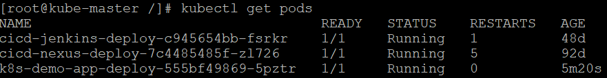

# k8s-demo-app
Kubernetes Demo App for Deploy

### Branch
    1. k8s-app : Kubernetes 배포 Application
    2. k8s-config : Kubernetes Config

### Example

  1. Jenkins Pipeline Deployment Example

  

  2. Checking the kubernetes pod running status
  ```bash
  $ kubectl get pods -A
  ```
  
