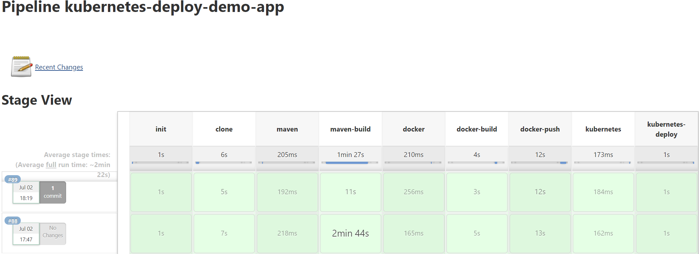
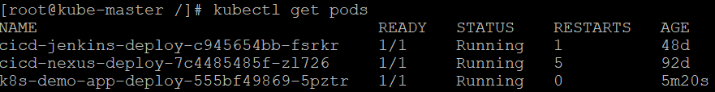

# k8s-demo-app

> Kubernetes demo application and manifests for deployment pipeline examples — Jenkins Pipeline to Kubernetes deployment reference.

[](https://kubernetes.io)
[](https://jenkins.io)
[](https://spring.io/projects/spring-boot)

## Overview

This repository contains the application source and Kubernetes manifests for demonstrating a complete **Jenkins → Kubernetes deployment pipeline**.

## Branches

| Branch | Description |
|--------|-------------|
| `k8s-app` | Spring Boot application source (Kubernetes deployment target) |
| `k8s-config` | Kubernetes configuration and manifest files |

## Pipeline Example

### 1. Jenkins Pipeline Deployment



### 2. Verify Pod Status

```bash
kubectl get pods -A
```



## Getting Started

```bash
# Clone the app branch
git clone -b k8s-app https://github.com/misoboy/k8s-demo-app.git

# Build
./mvnw clean package

# Apply Kubernetes manifests
git clone -b k8s-config https://github.com/misoboy/k8s-demo-app.git
kubectl apply -f k8s-config/
```

## License

MIT
